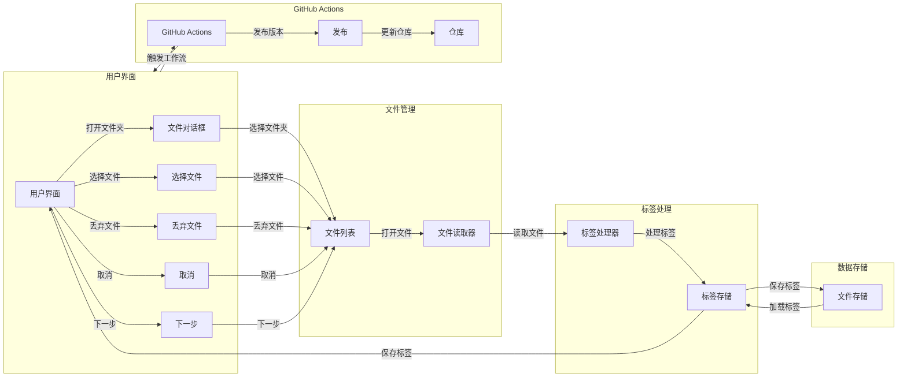

# s-photo

## 介绍

s-photo 是 share121 用 Tauri + TS + Rust
开发的一款开源照片筛选软件，它可以让你使用几个按键来快速筛选照片

## 优势

原先筛选照片需要，查看照片，然后把不需要的照片移动“弃用”文件夹，需要的照片移动到“选用”文件夹，这个过程存在大量的
**重复性劳动**。然而有了我的软件后，我可以使用 `Q` 键选用、`P` 键弃用、`Z`
键撤销、`↑` `↓` `←` `→` 键在文件中移动。

当你按下 `Q` 键时，会自动把照片移动到“选用”文件夹 当你按下 `P`
键时，会自动把照片移动到“弃用”文件夹

省去了打开照片、移动文件的繁杂过程

## 开发原因

学校三节期间，我作为信息部成员，需要筛选拍摄组拍摄的上万张照片，然而，原始的筛选方法太低效了。于是我开发了这款软件，使信息部的工作效率大大提高。

欢迎 👏 关注我的 B 站账号[\_share121](https://b23.tv/UzIsd79)

